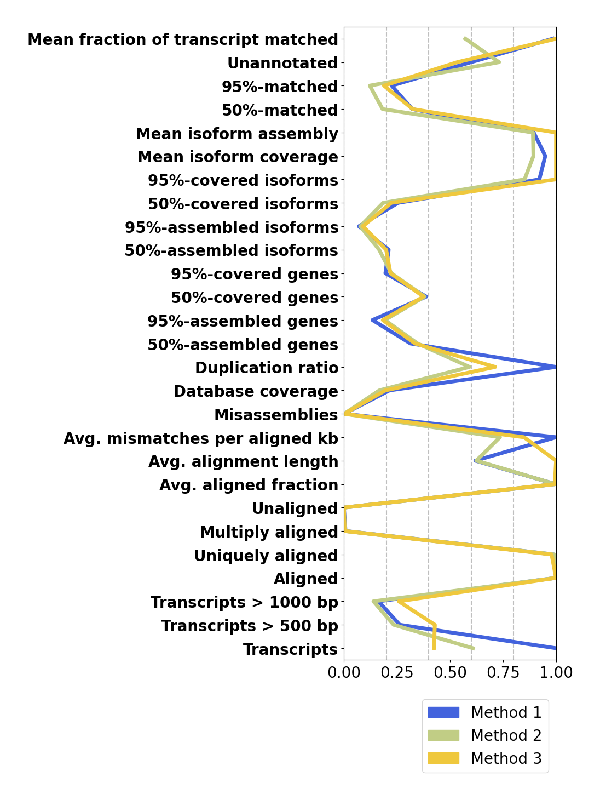
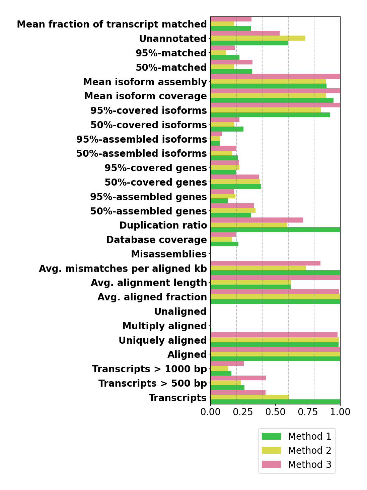

# rnaQUASTcompare

Small python command line tool that generates a comparative plot for multiple rnaQUAST short reports.<br>
rnaQUAST (https://github.com/ablab/rnaquast) is a great tool for the evaluation of transcriptome assemblies.<br>

It generates a multitude of metrics for the quality of transcriptome assemblies, many of them by mapping the transcripts to an annotated genome.<br>
rnaQUAST does a great job at rating individual assemblies, however, directly comparing different reports is not as easy.

## Usage

```
positional arguments:
  report_dirs           paths to output directories from rnaQUAST

options:
  -h, --help            show this help message and exit
  -names NAMES [NAMES ...]
                        list of names for the assemblies (default=["auto"])
  -colors COLORS [COLORS ...]
                        list of colors in hexcode (default=["auto"])
```

## Value scaling

First, found the metric "Avg. mismatches per transcripts" to favor assemblies with transcripts that are shorter or cannot be aligned as well and replaced it with "Avg. mismatches per aligned kb".

Second, comparisons usually work better with relative values so all metrics were scaled to a range of [0,1] which also enables better visualization.

I divided the metrics into groups:

- Gene metrics<br>
"50%-assembled genes", "95%-assembled genes", "50%-covered genes", "95%-covered genes"
- Isoforms metrics<br>
"50%-assembled isoforms", "95%-assembled isoforms", "50%-covered isoforms", "50%-covered isoforms"
- Transcript metrics<br>
"Transcripts > 500 bp", "Transcripts > 1000 bp", "Aligned", "Uniquely aligned", "Multiply aligned", "Unaligned", "Misassemblies", "Unannotated", "50%-matched", "95%-matched"
- Scaled metrics<br>
"Database coverage", "Avg. aligned fraction", "Mean fraction of transcript matched"
- Other metrics<br>
"Transcripts", "Avg. mismatches per aligned kb", "Duplication ratio"

Gene metrics are divided by the number of genes in the genome annotation<br>
Isoforms metrics are divided by the number of isoforms in the genome annotation.<br>
Isoforms metrics are divided by the number of sequences in the respective assembly.<br>
Scaled metrics are left unchanged.<br>
Other metrics are divided by the maximum value for all assemblies.

## Output

rnaQUASTcompare.py will generate a folder with the current date and time in the same directory.<br>

### 1. Plots

Line and bar plot for the scaled values

**Example:**

A comparison of three mouse transcriptome assemblies, each generated with a different tool.

<p float="left">
  
   
</p>

### 2. Dataframes

Dataframe with data of all reports with absolute and scaled values both in as .tsv and in latex style.
